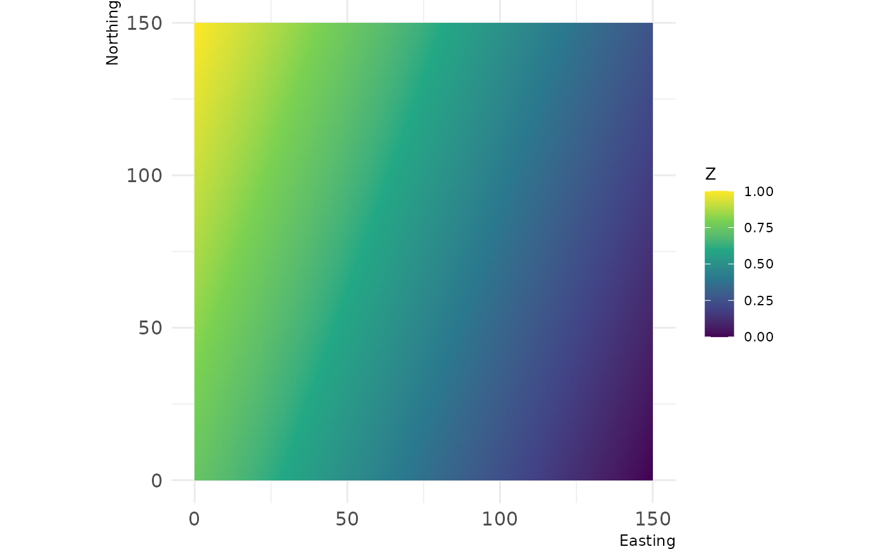
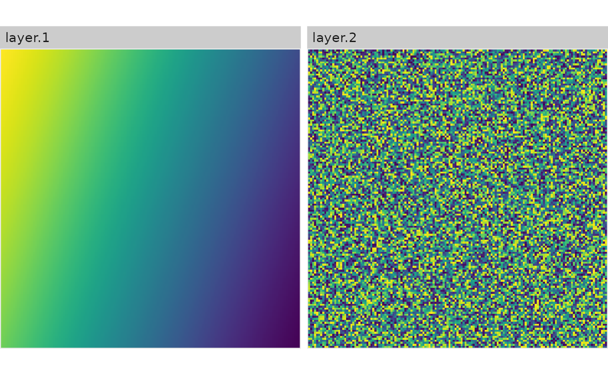
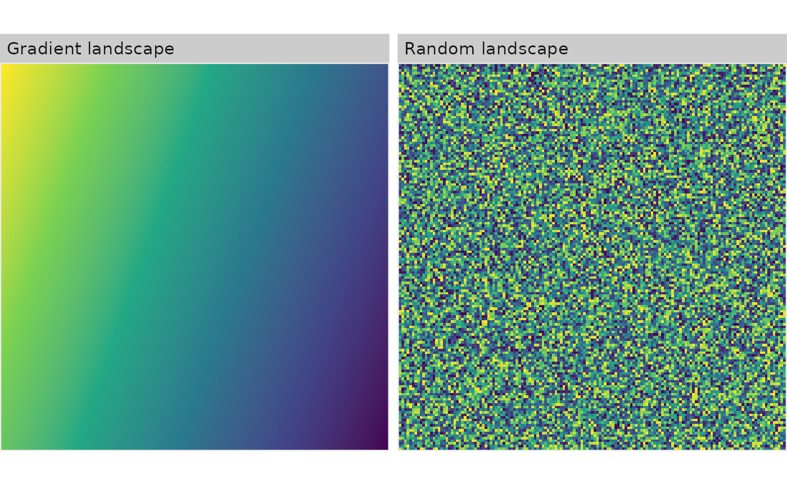
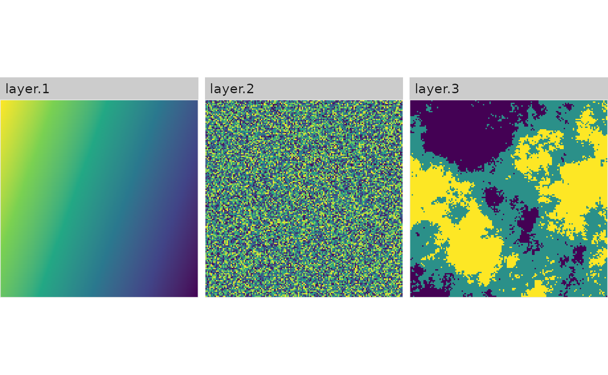
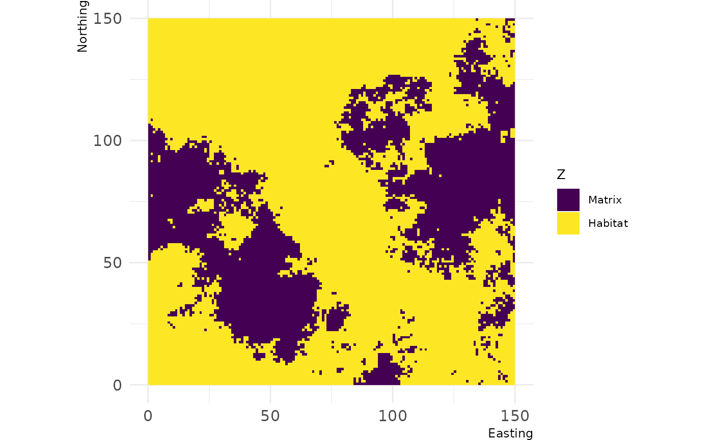
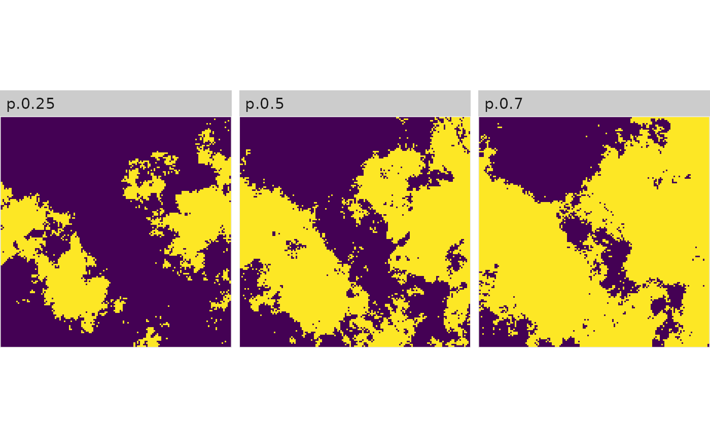
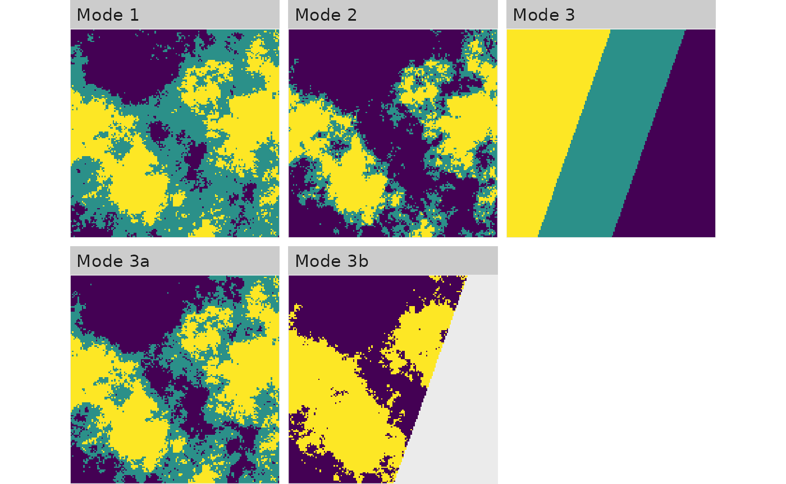
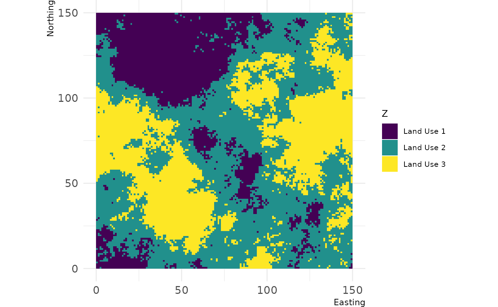
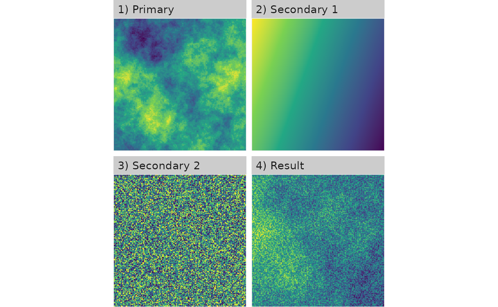

# Short walkthrough and overview of landscapetools

*landscapetools* is not a coherent package designed for a specific
scientific purpose, it is rather a collection of functions to perform
some of the less-glamorous tasks involved in landscape analysis.

It is basically designed to accompany all the packages in
[r-spatialecology](https://github.com/r-spatialecology) and keep them
lightweight. Hence, the functionality has a broad spectrum and we try to
cover here some things one might miss about *landscapetools*.

## Visualize

There are a plethora of R packages to visualize spatial data, all of
them covering unique aspects and ways to do that (find a short
introduction
[here](https://docs.ropensci.org/NLMR/articles/getstarted.html)). With
[NLMR](https://docs.ropensci.org/NLMR/), we needed a way to visualize
landscapes without much fuss and also have a way to visualize many of
them in a way we found sufficient.

### General raster plotting

``` r

# Plot continous landscapes
show_landscape(gradient_landscape)
```



``` r


# Plot continous landscapes 
show_landscape(classified_landscape, discrete = TRUE)
```


``` r


# RasterStack/RasterBrick
show_landscape(raster::brick(gradient_landscape, random_landscape), discrete = TRUE)
```



``` r


# Plot a list of raster (list names become facet text)
show_landscape(list("Gradient landscape" = gradient_landscape,
                    "Random landscape" = random_landscape))
```



``` r


# Plot multiple raster with unique scales
show_landscape(raster::stack(gradient_landscape, random_landscape, classified_landscape), unique_scales = TRUE)
```



## Scaling

### Binarize

In landscape ecology, many people work with landscapes that reflect a
matrix / habitat context. If you work with simulated landscapes,
`util_binarize` is a convienent wrapper to achieve this. You can define
a value in the range of your landscape values and get a binary
reflection of it:

``` r

# Binarize the landscape into habitat and matrix
binarized_raster <- util_binarize(fractal_landscape, breaks = 0.31415)
show_landscape(binarized_raster, discrete = TRUE)
```



``` r


# You can also provide a vector with thresholds and get a RasterStack with multiple binarized maps
binarized_raster <- util_binarize(fractal_landscape, breaks = c(0.25, 0.5, 0.7))
show_landscape(binarized_raster)
#> Warning: Removed 897 rows containing missing values or values outside the scale range
#> (`geom_raster()`).
```



### Classify

Complementary to `util_binarize`, `util_classify` classifies a landscape
with continuous values into *n* discrete classes. The function is quite
the workhorse, so I provide some extra detail here to explain
everything:

``` r

# Mode 1: Classify landscape into 3 classes based on the Fisher-Jenks algorithm:
mode_1 <- util_classify(fractal_landscape, n = 3)

# Mode 2: Classify landscapes into landscape with exact proportions:
mode_2 <- util_classify(fractal_landscape, weighting = c(0.5, 0.25, 0.25))

# Mode 3: Classify landscapes based on a real dataset (which we first create here)
#         and the distribution of values in this real dataset
mode_3 <- util_classify(gradient_landscape, n = 3)

## Mode 3a: ... now we just have to provide the "real landscape" (mode_3)
mode_3a <- util_classify(fractal_landscape, real_land = mode_3)

## Mode 3b: ... and we can also say that certain values are not important for our classification:
mode_3b <- util_classify(fractal_landscape, real_land = mode_3, mask_val = 1)

landscapes <- list(
'Mode 1'  = mode_1,
'Mode 2'  = mode_2,
'Mode 3'  = mode_3,
'Mode 3a' = mode_3a,
'Mode 3b' = mode_3b
)

show_landscape(landscapes, unique_scales = TRUE, nrow = 1)
#> Warning: Removed 1495 rows containing missing values or values outside the scale range
#> (`geom_raster()`).
```



``` r


# ... you can also name the classes:
classified_raster <- util_classify(fractal_landscape,
                                   n = 3,
                                   level_names = c("Land Use 1",
                                                   "Land Use 2",
                                                   "Land Use 3"))
show_landscape(classified_raster, discrete = TRUE)
```



### Rescale

`util_rescale` linearly rescales element values in a raster to a range
between 0 and 1.

``` r

library(raster) 
#> Loading required package: sp
landscape <- raster(matrix(1:100, 10, 10))
summary(landscape)
#>          layer
#> Min.      1.00
#> 1st Qu.  25.75
#> Median   50.50
#> 3rd Qu.  75.25
#> Max.    100.00
#> NA's      0.00

scaled_landscape <- util_rescale(landscape)
summary(scaled_landscape)
#>         layer
#> Min.     0.00
#> 1st Qu.  0.25
#> Median   0.50
#> 3rd Qu.  0.75
#> Max.     1.00
#> NA's     0.00
```

### Merge

`util_merge` most likely makes sense in the context of
[NLMR](https://docs.ropensci.org/NLMR/). If you merge multiple neutral
landscapes models, you can create more feasible landscape patterns for
certain questions, or come up with ecotones if you merge fractal
patterns with gradients.

``` r

# Merge all maps into one
merg <- util_merge(fractal_landscape, c(gradient_landscape, random_landscape), scalingfactor = 1)

# Plot an overview
merge_vis <- list(
    "1) Primary" = fractal_landscape,
    "2) Secondary 1" = gradient_landscape,
    "3) Secondary 2" = random_landscape,
    "4) Result" = merg
)
show_landscape(merge_vis)
#> Warning: Removed 1196 rows containing missing values or values outside the scale range
#> (`geom_raster()`).
```



## Rescale

``` r

util_rescale(fractal_landscape)
```
